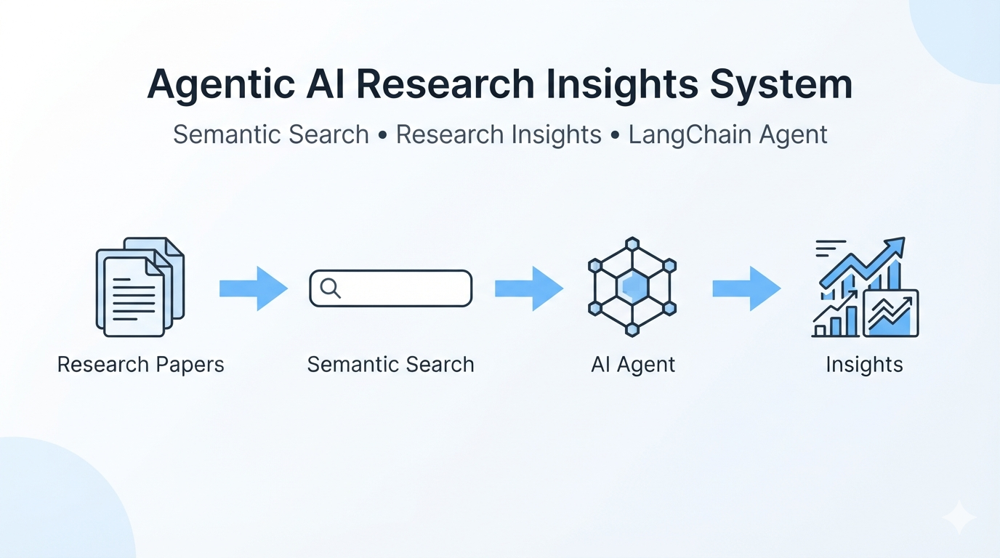

# 🔬 Research Insights Platform

<p align="center">
  
</p>


An Agentic AI-powered research assistant that enables semantic exploration of research papers using Sentence Transformers, FAISS, Hugging Face models, KeyBERT, spaCy, LangChain, and Groq LLMs.

The system goes beyond traditional keyword search by understanding the meaning of research papers, generating summaries, extracting important keywords and entities, comparing research topics, producing insights, and supporting agentic interaction through LangChain.

---

## Features~

### Semantic Search
- Generates dense embeddings using Sentence Transformers.
- Stores embeddings using FAISS.
- Retrieves the most semantically similar research papers.
- Understands meaning instead of relying on keyword matching.

---

### Research Paper Summarization~
- Uses Hugging Face Transformer models.
- Produces concise summaries of selected research papers.
- Makes lengthy papers easier to understand.

---

### Keyword Extraction
- Uses KeyBERT.
- Identifies the most important research keywords.
- Helps understand major themes within papers.

---

### Named Entity Recognition (NER)
- Uses spaCy.
- Extracts:
  - Organizations
  - People
  - Locations
  - Technologies
  - Research-related entities

---

### Research Insights
Generates insights from retrieved papers by combining:
- Keywords
- Named Entities
- Research Trends

This provides a quick overview of common topics and recurring concepts.

---

### Topic Comparison
Allows comparison between two research areas.

Example:

- Transformers vs Diffusion Models
- Reinforcement Learning vs Computer Vision

The system retrieves relevant papers for each topic and compares them.

---

### Research Statistics
Provides useful statistics including:
- Number of papers
- Embedding information
- Search-related statistics
- Dataset overview

---

### Lightweight Python Agent
A lightweight rule-based research agent is included as a fallback.

It can automatically choose which existing function to execute based on the user's request.

---

### LangChain Agent
The project extends the lightweight agent by introducing an Agentic AI architecture using LangChain.

The LangChain Agent:
- Uses ChatGroq as the LLM.
- Wraps existing project functions as LangChain Tools.
- Automatically decides which tools to invoke.
- Reuses the existing project logic without duplicating code.

---

## Technologies Used

- Python
- Google Colab
- Pandas
- NumPy
- Sentence Transformers
- FAISS
- Hugging Face Transformers
- KeyBERT
- spaCy
- LangChain
- LangChain Core
- LangChain Groq
- Groq API

---

## Project Workflow

```
Research Papers
        │
        ▼
Text Cleaning
        │
        ▼
Sentence Transformer Embeddings
        │
        ▼
FAISS Vector Database
        │
        ▼
Semantic Search
        │
        ├───────────────┐
        ▼               ▼
 Summarization     Keyword Extraction
        │               │
        ▼               ▼
 Named Entity Recognition
        │
        ▼
 Research Insights
        │
        ▼
 LangChain Tools
        │
        ▼
 ChatGroq Agent
        │
        ▼
 Final Response
```

---

## Agent Tools

The LangChain Agent exposes the following tools:

- Semantic Search Tool
- Paper Summarization Tool
- Keyword Extraction Tool
- Named Entity Recognition Tool
- Research Insights Tool
- Topic Comparison Tool
- Research Statistics Tool

Each tool wraps an existing function from the notebook without modifying its implementation.

---

## Example Queries

### Semantic Search

```
Find papers on Reinforcement Learning.
```

---

### Paper Summarization

```
Summarize papers about Vision Transformers.
```

---

### Topic Comparison

```
Compare Transformers and Diffusion Models.
```

---

### Named Entity Analysis

```
What are the common organizations mentioned?
```

---

### Research Insights

```
What are the latest trends in Generative AI?
```

---

### Research Statistics

```
Show statistics.
```

---

## Project Structure

```
Notebook
│
├── Data Loading
├── Text Preprocessing
├── Sentence Embeddings
├── FAISS Index
├── Semantic Search
├── Hugging Face Summarization
├── KeyBERT Keyword Extraction
├── spaCy Named Entity Recognition
├── Research Insights
├── Topic Comparison
├── Research Statistics
├── Lightweight Python Agent
├── LangChain Tool Wrappers
├── ChatGroq Agent
└── ask_agent()
```

---

## Setup

Install the required libraries:

```bash
pip install sentence-transformers
pip install faiss-cpu
pip install transformers
pip install keybert
pip install spacy
pip install langchain
pip install langchain-core
pip install langchain-groq
```

Download the spaCy model:

```bash
python -m spacy download en_core_web_sm
```

Set your Groq API Key:

```python
import os

os.environ["GROQ_API_KEY"] = "YOUR_API_KEY"
```

or use Google Colab Secrets:

```python
from google.colab import userdata
```

---

## Running the Agent

Use the helper function:

```python
ask_agent("Find papers on Reinforcement Learning.")
```

The LangChain Agent automatically selects the appropriate tools required to answer the query.

---

## Future Improvements

- Multi-document question answering
- Research paper recommendations
- Citation analysis
- PDF upload support
- Retrieval-Augmented Generation (RAG)
- Streamlit/Web application
- Multi-agent collaboration

---

## Author

**Harshit Rao**

B.Tech Computer Science Engineering

AI • Machine Learning • Agentic AI • NLP
